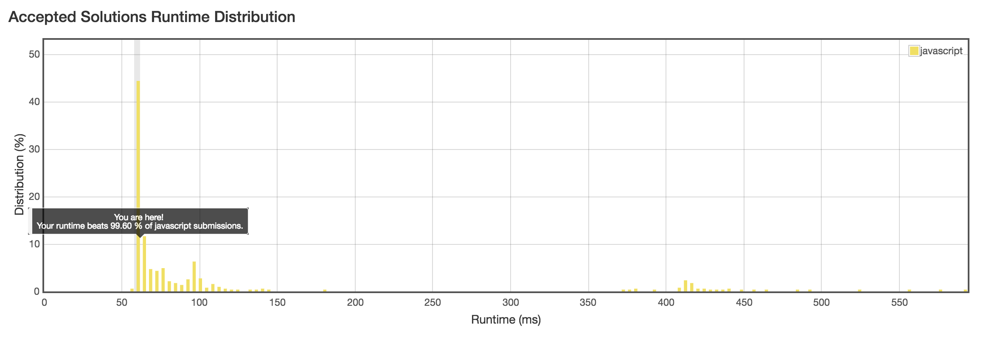

# Coding Practice

## Thanks for visiting my Coding Problems GitHub Repository!

I'll be using this space to store some fun practice problems I've completed, as I work to improve my algorithms and code efficiency!

Any suggestions to help me shore up my code is always appreciated!

To consistently get results like the one shown above is the goal. To have the most efficient and clean code for a future business to use is a goal I want to consistently strive for. Please feel free to reach out if there are any improvements that I can make!
